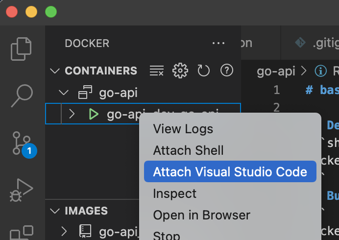

# Account JWT on Go

Go, gorm, Gin web framework 를 활용하여 만든 간단한 JWT API 입니다.  
Dajngo의 Simple JWT 플러그인을 참고하여 만들었습니다.
  
## API endpoints
### 1. Basic
* [POST]/account
  * 회원가입
  * Request
    * json data(body)
        ``` 
        {
            "email": "string",
            "login_id": "string",
            "name": "string",
            "password": "string"
        } 
        ```
  * Response
    * json data(body)
        ```   
        {
            "access_token": "string",
            "refresh_token": "string",
            "user_id": 0
        }
        ```
* [POST]/account/login
  * 로그인
  * Request
    * json data(body)
        ``` 
        {
            "login_id": "string",
            "password": "string"
        }
        ```
  * Response
    * json data(body)
        ```   
        {
            "access_token": "string",
            "refresh_token": "string",
            "user_id": 0
        }   
        ```
* [POST]/account/valid
  * access token 검증 
    * json data(body)
        ``` 
        {
            "access_token": "string"
        }
        ```
  * Response
    * result
        ```   
        true/false
        ```
* [POST]/account/renew
  * access token 갱신
  * Request
    * json data(body)
        ``` 
        {
            "refresh_token": "string"
        }
        ```
  * Response
    * json data(body)
        ```   
        "access token string"  
        ```

### 2. Swagger
* [GET] /swagger/index.html

## Development

### 1. docker-compose up
```shell
$ cd dev
$ docker-compose up
```
### 2. Attatch vscode
<div align="center">
    
</div>

### 3. Run main.go on debug

<div align="center">
    </img>
</div>

### 4. Create Docs

```
$ swag
$ cd /root/src/
$ swag init
```


## Build deployment image

```
$ docker build -t account-jwt:latest .

$ docker run -p 8000:8000 --env-file .env account-jwt:latest
```

## Reference
  - Hands-On Full-Stack Development with Go
  - https://github.com/gin-gonic/gin
  - https://github.com/golang-jwt/jwt
  - https://django-rest-framework-simplejwt.readthedocs.io